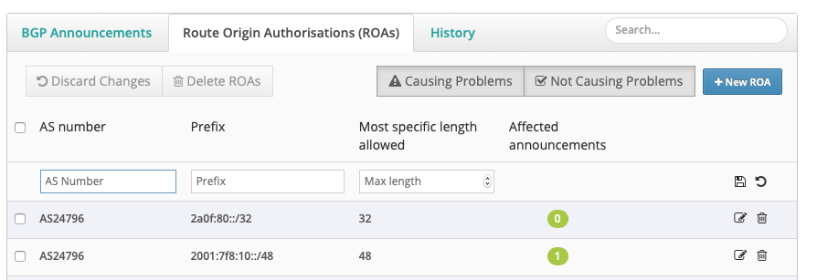
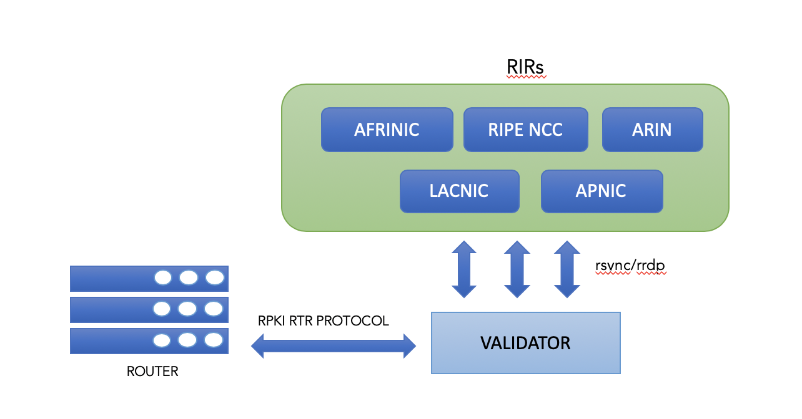
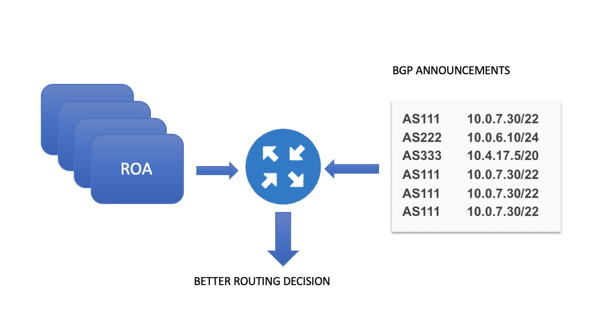

# Resource Public Key Infrastructure (RPKI)

## Sommario

- [Cos'è](RPKI.md#cosè)
- [Architettura RPKI](RPKI.md#architettura-rpki)
- [Route Origin Authorization (ROA)](RPKI.md#route-origin-authorization-roa)
- [Creazione dei ROA](RPKI.md#creazione-dei-roa)
- [ROA con AS Origine = 0](RPKI.md#roa-con-as-origine--0)
- [Route Origin Validation (ROV)](RPKI.md#route-origin-validation-rov)
- [Aspetti di configurazione](RPKI.md#aspetti-di-configurazione)
- [Software di validazione](RPKI.md#software-di-validazione)

## Cos’è

Molti degli incidenti nell’Internet sono causati dalla propagazione di incorrette informazioni di routing. 
Le più comuni minacce, come ad esempio route hijacking o route leak, sfruttano una vulnerabilità di fondo del 
protocollo BGP: l’impossibilità di verificare se gli *Autonomous System (AS)* che propagano gli annunci sono realmente 
legittimati nel farlo. Infatti, le informazioni sulle proprietà delle risorse Internet (ASN e prefissi) sono contenute 
all’interno di database pubblici chiamati *Internet Routing Registry (IRR)*, gestiti e mantenuti dai *Regional 
Internet Registry (RIR)*. Non risiedono quindi all’interno del protocollo BGP.

Il BGP non ha alcuno strumento per verificare se un AS che annuncia un determinato prefisso nell’Internet sia autorizzato a farlo, ossia se il prefisso annunciato gli è stato assegnato effettivamente da un RIR. Dato che ogni prefisso può essere annunciato e originato da ogni AS, indipendentemente dal suo diritto nel farlo, è necessario un meccanismo out-of-band per aiutare il BGP a verificare *quale AS può annunciare quale prefisso*.

Questo meccanismo esiste. E’ parte del sistema IRR. Come accennato in precedenza esistono dei database pubblici che contengono le informazioni sulla proprietà dei prefissi, alcuni gestiti dai grandi operatori, altri gestiti dai RIR stessi. E’ ormai ampiamente diffuso generare i filtri a partire dalle informazioni presenti negli IRR. Esiste però un limite a questo sistema: possiamo fidarci di queste informazioni? Purtroppo il sistema IRR è ben lontano dall’essere completo, gli oggetti che rappresentano le informazioni <Prefissi; AS autorizzati> non sono del tutto affidabili, questo perchè spesso non vengono aggiornati o contengono informazioni errate.

Per ovviare a questo problema, il gruppo SIDR (Secure Inter Domain Routing) di IETF ha sviluppato nel 2012 un framework (RFC 6481) basato su una struttura pubblica (Resource Public Key Infrastructure) con dei database distribuiti (RPKI repository) dove sono contenute le associazioni <Prefissi; AS autorizzati>. A ciascuna associazione è legato un Certificato Digitale, che consente a chi consulta i database, di verificare che le associazioni siano corrette. Tali attestati (prefissi, ASN e certificati digitali) vengono denominati ROA (Route Origin Authorization).

RPKI utilizza il formato dei certificati digitali X.509 con l’estensione per indirizzi IP e ASN (RFC 3779). I certificati non includono le informazioni di identità ma il loro scopo è solo quello di trasferire il diritto all’uso delle risorse Internet. I RIR svolgono la funzione di Certification Authority (CA) e si occupano dell’emissione dei certificati digitali. L’utilizzo principale dei certificati digitali è quello di validare le chiavi pubbliche e la legittimità di un AS a iniettare nel BGP un determinato blocco di prefissi e di utilizzare un determinato numero di AS.

## Architettura RPKI


L’architettura è basata su dei database *(RPKI repository)*, dove sono contenute le informazioni sui ROA, informazioni che possono essere immesse direttamente dai RIR o anche dai NIR/LIR/ISP (verificate comunque dai RIR) attraverso un particolare *Publication Protocol*. 

Ciascun RPKI repository, oltre ai ROA, mantiene anche una lista di *sub-RPKI repository (anche detti Trust Anchors)* che vengono utilizzati per sincronizzare le informazioni sui ROA e quindi realizzare un unico RPKI repository virtuale a livello mondiale.

Sulla base dei ROA contenuti nei RPKI repository, un AS può validare la correttezza degli annunci ricevuti e scegliere in modo selettivo gli annunci che vuole accettare o meno. 


Affinché tutto ciò sia efficace, è necessaria per un AS la certezza che le informazioni dei RPKI repository siano corrette e sincronizzate a livello mondiale. L’architettura RPKI prevede quindi una gerarchia di RPKI repository e quindi di Certificali Digitali, che segue la stessa gerarchia prevista per l’assegnazione degli indirizzi IP, che può essere semplificata come segue: *IANA→RIR→NIR/LIR*. I 5 RIR mondiali hanno il compito di gestire ciascuno il RPKI repository dei ROA della propria area, e di mettere queste informazioni a disposizione degli altri RIR e degli ISP di tutto il mondo.  

Lato ISP, l’architettura prevede l’utilizzo di server denominati *RPKI Validator*, che a loro volta si interfacciano con i RPKI repository dei vari RIR per effettuare un download locale dei ROA. I router di Edge dell’ISP, attraverso il protocollo standard *RPKI-to-Router Protocol* (RFC 6810 - The Resource Public Key Infrastructure to Router Protocol, Gennaio 2013), scaricano localmente i ROA presenti nel RPKI Validator, inserendoli in una *RPKI Table*. All’arrivo di un annuncio BGP, un router può così inferire sulla validità o meno degli annunci che riceve, confrontando il contenuto degli annunci con quello dei ROA presenti nella propria RPKI Table.

## Route Origin Authorization (ROA)

I ROA sono oggetti firmati digitalmente. Accoppiano un AS a uno o più prefissi IP. Possono essere visti come degli oggetti che forniscono un mezzo per verificare se un AS è autorizzato ad annunciare un determinato prefisso IP.

Formato di un ROA IPv4:

| Prefisso originato | 172.16.0.0/16 |
| ----------- | ------ |
| MaxLength | 24 |
| AS Origine | 12345 |
| Firma Digitale | qç!r5@eX!%89?@cv! |

Formato di un ROA IPv6:

| Prefisso originato | 2001:db8:1::/48 |
| ----------- | ------ |
| MaxLength | 48 |
| AS Origine | 12345 |
| Firma Digitale | qç!r5@eX!%89?@cv! |

Un ROA ha 4 componenti:

1) __Prefisso originato__: Un prefisso IPv4 o IPv6, con una determinata lunghezza della maschera. Tipicamente è un prefisso assegnato da un RIR a un NIR/LIR/ISP

2) __MaxLength__: la lunghezza massima della maschera, specifica quali subnet IP del prefisso originato possono essere annunciate

3) __AS Origine__: il numero dell’AS che origina il prefisso IP o una sua subnet ammessa, ossia con lunghezza della maschera inferiore o al più uguale a quella specificata nel punto precedente

4) __Firma Digitale__: basata sul sistema chiave pubblica/chiave privata

## Creazione dei ROA

I RIR forniscono una soluzione hosted nascondendo tutti i dettagli relativi alla complessità crittografica. Un operatore deve focalizzare la propria attenzione solo sulla creazione e pubblicazione dei ROA per i prefissi annunciati.

La prima cosa da fare è accedere al portale del RIR di riferimento (in questa guida faremo riferimento al portale di RIPE NCC, https://www.ripe.net). Una volta autenticati, cliccare sul tab "My Resources".


Nella schermata successiva, cliccare nel menu a sinistra sulla voce "RPKI dashboard" e quindi sul tab "Route Origin Authorisations (ROAs)"


Da qui è possibile visualizzare l'elenco dei ROA creati, aggiungerne di nuovi oppure cancellarli. Nel momento in cui si crea un nuovo ROA è necessario specificare il proprio AS origin, il prefisso e la massima lunghezza della maschera.



## ROA con AS Origine = 0

La RFC 6491 - Resource Public Key Infrastructure (RPKI) Objects Issued by IANA, specifica che il valore AS = 0 in un ROA va utilizzato per identificare prefissi che non devono essere annunciati nell’Internet e quindi non utilizzati per il routing dei pacchetti. Questo consente a chi detiene un determinato prefisso IP di indicare che il prefisso ed eventualmente tutte le sue subnet IP, non può essere utilizzato per il routing dei pacchetti IP.

Nella definizione di un ROA con AS = 0, è buona pratica definire Max-Maschera = Max-ROA, anche se qualcuno preferisce definire come Max-Maschera il valore 32 per IPv4 e 128 per IPv6. Ma il risultato finale non cambia.

L’utilizzo dell’AS = 0 è stato specificato nella RFC 7607 - Codification of AS 0 Processing, Agosto 2015.

## Route Origin Validation (ROV)

Il processo di validazione di un annuncio BGP, si basa su un confronto tra le informazioni contenute nell’annuncio, e i ROA presenti nel database del router stesso, scaricati dal RPKI Validator. 



Il Validator è un software dedicato a scaricare una copia in locale di tutti i ROA dai repository RPKI dei RIR. Il risultato è una lista di tutte le combinazioni ASNs e prefissi chiamata "validated cache". Una volta che il ROA viene validatol'oggetto risultante contiene un prefiso IP, il parametro MaxLength (la lunghezza massima della maschera) e l'AS origine del prefiso stesso. Questo oggetto è chiamato "Validated ROA Payload (VRP)".

I router inoltre interrogano il validatore tramite il protocollo RTR per verificare la validità o meno dei prefissi ricevuti dalle sessioni BGP.

Quando un router riceve un annuncio BGP, compara l'annuncio appena ricevuto con la lista dei VRPs. 



I possibili risultati del processo di validazione, come descritto nella RFC 6811, sono tre: Valid, Invalid e NotFound:

- __Valid__: il prefisso nell'annuncio ricevuto è coperto da almeno un ROA
- __Invalid__: il prefisso è annunciato da un non autorizzato AS oppure il prefisso è più specifico rispetto alla lunghezza massima autorizzata nel ROA
- __NotFound__: il prefisso nell'annuncio non ha un ROA corrispondente

Sulla base del risultato ottenuto dal processo di validazione è possibile istruire i propri router nel prendere un qualche tipo di decisione come ad esempio modificare la Local Preference in base allo stato di validazione. __E' buona pratica ad ogni modo scartare gli annunci con stato "invalid"__.

__esempi di validazione__

| ROA | AS Origine: 6762 | Prefisso: 79.140.80.0/20 | MaxLength: 24 |
| ----------- | ------ | ------ | ------ |
| Valid | AS 6762 | 79.140.80.0/21 |
| Valid | AS 6762 | 79.140.92.0/22 |
| Invalid | AS 2914 | 79.140.84.0/22 |
| Invalid | AS 6762 | 79.140.91.0/25 |
| NotFound | AS 1299 | 79.140.0.0/16 |

__esempio ROA con AS = 0__

| ROA | AS Origine: 0 | Prefisso: 79.140.80.0/20 | MaxLength: 20 |
| ----------- | ------ | ------ | ------ |

In questo caso il risultato del processo di validazione sarà sempre uno stato di "Invalid".

## Aspetti di configurazione

Per stabilire la sessione RTR con il Validator è sufficiente specificare tre parametri:

1) Indirizzo IP del Validator
2) La porta TCP da utilizzare. Di solito la porta utilizzata dal RPKI Validator è la 323, ma può anche essere diversa. Ad esempio, se si utilizzasse il RPKI Validator fornito dal RIR Europeo RIPE NCC, la porta da utilizzare è la 8282
3) Il periodo delle query verso il RPKI Validator (refresh time) per il download dei ROA. Un valore tipico utilizzato nelle applicazioni pratiche è 600 sec

```Cisco IOS e IOS XE

Cisco IOS e IOS XE

  router(config)# router bgp numero-AS
  router(config-router)# bgp rpki server tcp IP-RPKI-Validator port porta-RPKI-Validator refresh secondi
  
```
```Cisco IOS XR

Cisco IOS XR

  RP/0/RP0/CPU0:router(config)# router bgp numero-AS
  RP/0/RP0/CPU0:router(config-bgp)# rpki server IP-RPKI-Validator 
  RP/0/RP0/CPU0:router(config-bgp-rpki-server)# transport tcp port porta-RPKI-Validator 
  RP/0/RP0/CPU0:router(config-bgp-rpki-server)# refresh-time secondi

```


## Software di validazione

- Routinator: https://www.nlnetlabs.nl/projects/rpki/routinator/

- Ripe NCC Validator: https://www.ripe.net/manage-ips-and-asns/resource-management/certification/tools-and-resources 

- OctoRPKI: https://github.com/cloudflare/cfrpki#octorpki

- rcynic: https://github.com/dragonresearch/rpki.net
